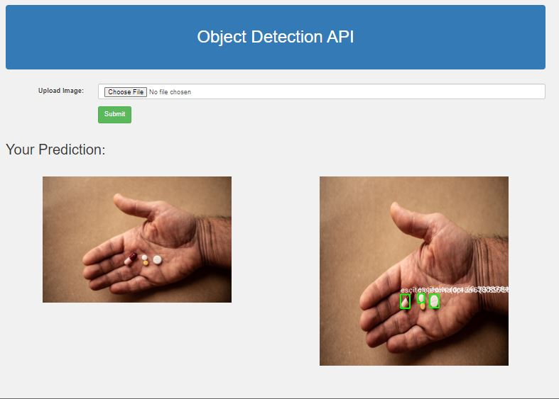

This Flask project is designed for detecting pills in an image using the YOLOv5 object detection algorithm. The project includes a web interface 
that allows the user to upload an image of pills and view the results of the detection process.

When the user uploads an image, the Flask API receives the image data and passes it to the YOLOv5 model for detection. The model uses its pre-trained
weights to detect pills in the image and returns the detected objects with their bounding box coordinates.

The Flask API then draws bounding boxes around the detected pills and saves the annotated image to the server. The annotated image is then displayed to
the user through the web interface, along with the original image.

  
  
  
  

